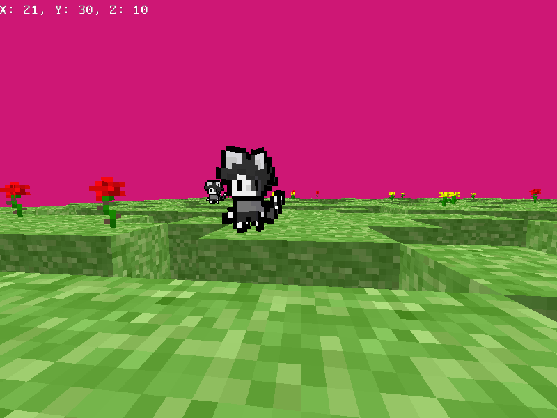

# Vakraft
Yet another Voxel Game

This game is being developed using my custom engine called [scarablib](https://github.com/vaaako/scarablib)

# Building
## Requirements
> [!NOTE]
> These are only required for the header files. You can move the header files folder from each library into the `include/external` directory and it should compile without having to install the libraries

- [scarablib](https://github.com/vaaako/scarablib) *(header files only)*
- [glew](http://glew.sourceforge.net/)
- [SDL2](https://www.libsdl.org/)
- [glm](https://github.com/g-truc/glm)

## Compiling
Just run `make` and it should work (no windows support)
